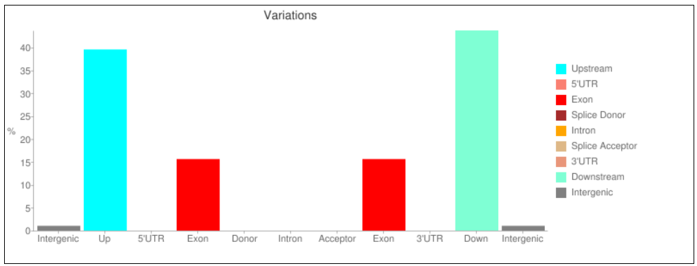

   

  

# Luiz Carlos
*Biólogo* - Analista de dados biológicos / Bioinformáta

Possui graduação em Ciências Biológicas e Mestrado em Ciências pelo Departamento de Biologia Celular e Molecular e Bioagentes Patogênicos.
Atuou como Técnico de Laboratório (Trainne) e Pesquisador (Mestrando) no Centro de Pesquisas em Virologia (USP).
Recentemente, atuou como Analista de Laboratório no controle de qualidade biológico, realizando testes de controle de qualidade de vacinas virais.
Atualmente, desenvolve análise de dados biológicos dentre outras análises que envolvam bionformática.

**Experiência em:** Biologia Celular e Molecular, Virologia, Análise Exploratória de Dados, Python, R, bash-unix.

**Links:**

* [LinkedIn](https://www.linkedin.com/in/luiz-carlos-vieira-4582797b/)

# Sobre este Projeto:

## Chamada de variantes (Variant Call)

A chamada de variantes envolve a identificação de polimorfismos de nucleotídeo único (SNPs) e pequenas inserções e deleções (indels) 
de dados de Sequenciamento de Nova Geração (NGS). Nesta pipeline descrevo a detecção de SNP para identificação possíveis alterações dos aminoácidos em proteínas do virais.

### Introdução

Muitas das variantes que surgiram no final de 2020 e início de 2021 compartilham mutações definidoras de aminoácidos. Algumas delas são mutações que interessam aos cientistas.  
Em alguns casos, um grupo de variantes com alterações genéticas semelhantes podem ser designados como Variante de preocupação VOC (“variants of concern”) ou Variante de Interesse VOI (“variants of interest) devido as características compartilhadas, que podem exigir medidas de saúde pública.  

Com isso, um trabalho bastante importante é a vigilância e busca por variações nos genomas sequenciados de SARS-CoV-2. Por isso, para quem tiver interesse, compartilho com vocês uma pipeline de [“Variant Call”](https://github.com/ziul-bio/Variant_call/blob/main/VariantCall.md) de amostras sequenciadas da covid19. Nela busco por variações no genoma, que indiquem possíveis alterações dos aminoácidos em proteínas do virais.

### Definições:

Mutação: Uma mutação refere-se a uma única alteração no genoma de um vírus (código genético). Mutações acontecem com frequência, mas apenas algumas vezes alteram as características do vírus.  

Linhagem: Uma linhagem é um grupo de vírus intimamente relacionados com um ancestral comum. Uma linhagem de SARS-CoV-2 tem muitas variantes, todas causando COVID-19.  

Variante: Uma variante é um genoma viral (código genético) que pode conter uma ou mais mutações.  

### Objetivos

* Buscar por variações no genoma, que indiquem possíveis alterações dos aminoácidos em proteínas do virais.

### Metodologias

Nesta análise usarei algumas ferramentas para análise de dados genômicos, tais como:  

* Linguagem bash 
* fastqc, fastp, bwa, samtools, bcftools, freebayes, IGV, snpEff. 

### Referências

https://www.cdc.gov/coronavirus/2019-ncov/variants/variant-classifications.html
https://www.nature.com/articles/s41564-020-0770-5
https://covariants.org/shared-mutations

