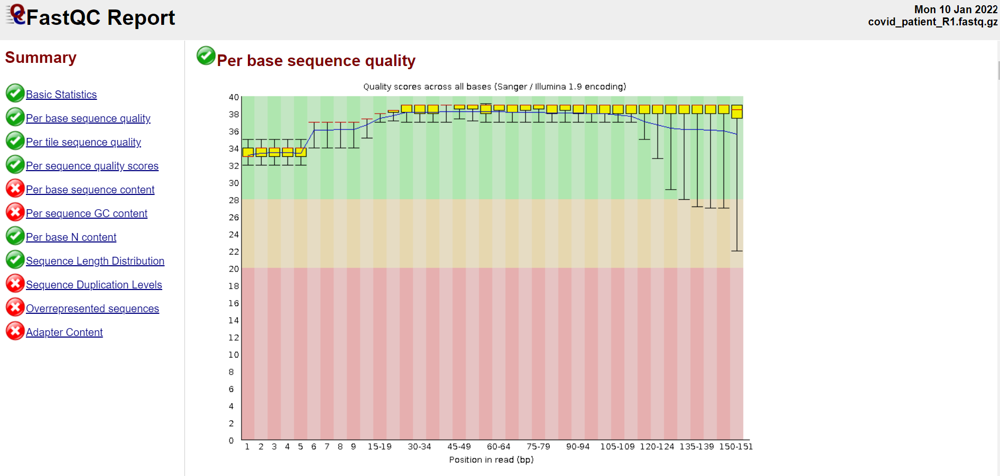
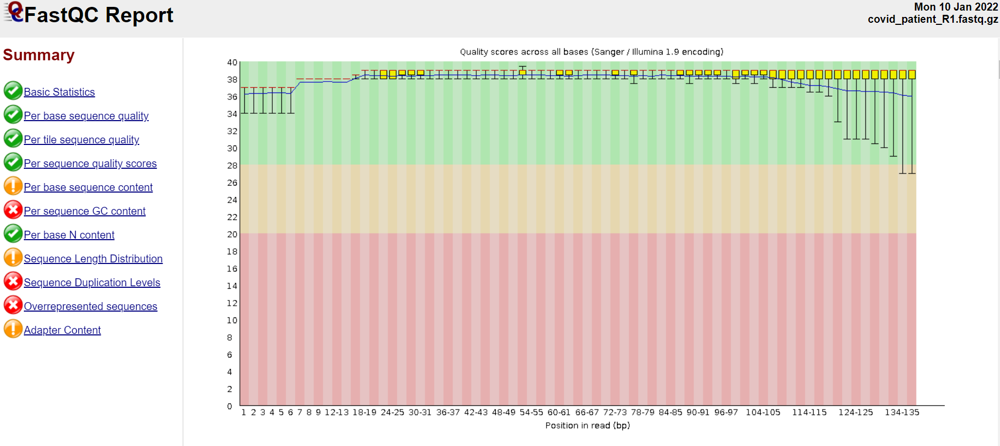
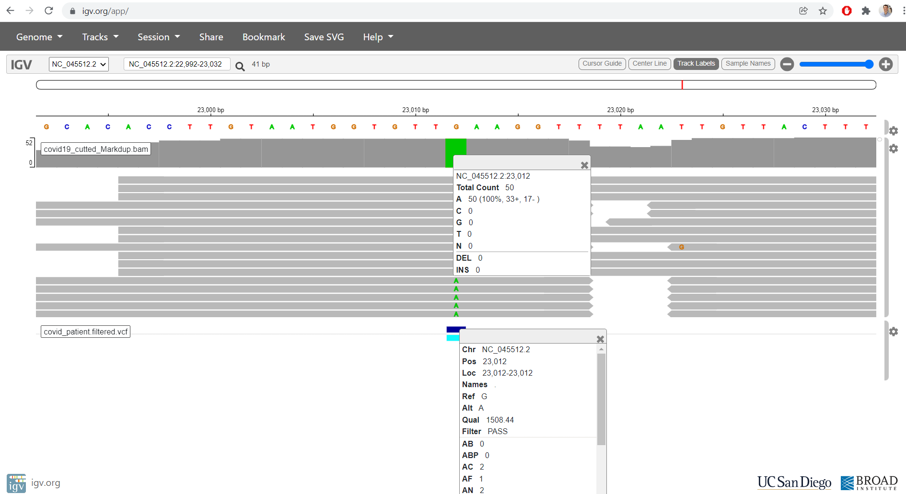
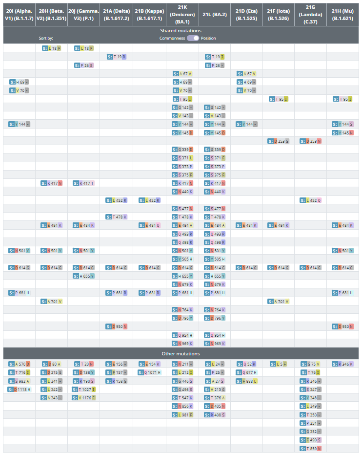
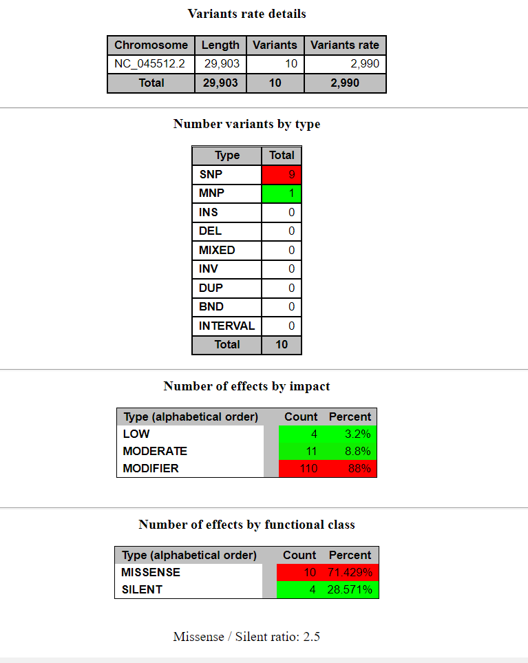
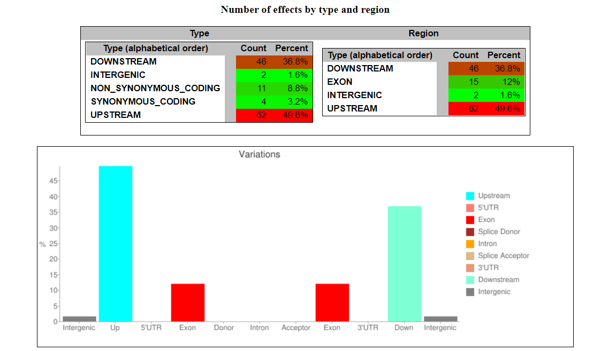
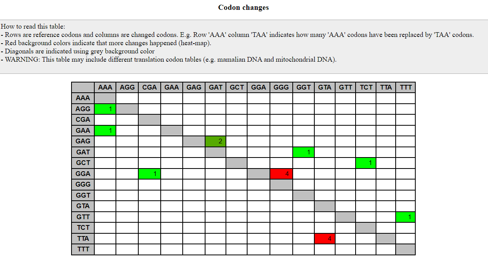
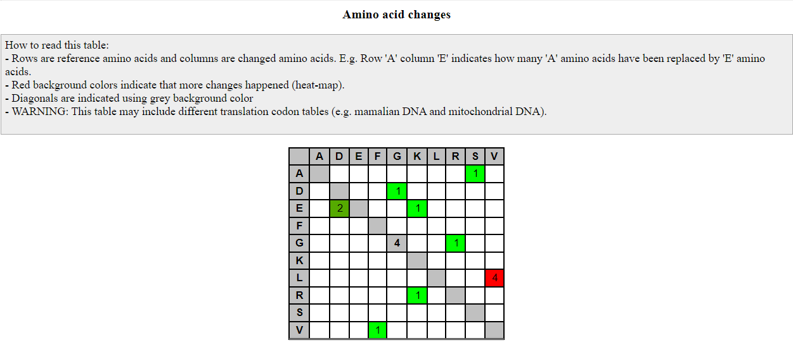

# Variant calling

A chamada de variantes envolve a identificação de polimorfismos de nucleotídeo único (SNPs) e pequenas inserções e deleções (indels) 
de dados de Sequenciamento de Nova Geração (NSG). Nesta pipeline descrevo a detecção de SNP para identificação possíveis variantes do vírus SARS-CoV-2.

### Criando os diretório para guardar os arquivos das análises
```bash
mkdir -p ref_genome raw_fastqc passedQC  mapped variants
```

## Baixando os dados

### Genoma de referência e anotação
[link-to-NCBI](https://www.ncbi.nlm.nih.gov/genome/86693?genome_assembly_id=757732)

```bash
# fasta file
wget -P ref_genome/ https://ftp.ncbi.nlm.nih.gov/genomes/all/GCF/009/858/895/GCF_009858895.2_ASM985889v3/GCF_009858895.2_ASM985889v3_genomic.fna.gz

# GFF file
wget -P ref_genome/  https://ftp.ncbi.nlm.nih.gov/genomes/all/GCF/009/858/895/GCF_009858895.2_ASM985889v3/GCF_009858895.2_ASM985889v3_genomic.gff.gz

# Para extrair os arquivos use:
# the option -k, (keep) não deleta os arquivos de entrada.
gzip -k -d GCF_009858895.2_ASM985889v3_genomic.fna.gz
gzip -d GCF_009858895.2_ASM985889v3_genomic.gff.gz

# Para renomear use:
mv GCF_009858895.2_ASM985889v3_genomic.fna covid_genome.fna
mv GCF_009858895.2_ASM985889v3_genomic.gff covid_genome.gff
```

### Arquivos fastq provenientes do sequenciamento

Abaixo estou passando uma lista de url, um por linha dos aquivos a serem baixados no arquivos.txt
covid_pacient_R1.fastq e covid_pacient_R2.fastq provenientes do sequenciamento.
```bash
wget -P fastq/ -i raw_fastq/raw_fastq_urls.txt
```


# Controle de Qualidade das Sequências com FASTP e FASTQC

O controle de qualidade e o pré-processamento de arquivos FASTQ são essenciais para fornecer dados limpos para análise downstream.

### Gerando um relatório da qualidade das reads antes da trimagem
```bash
fastqc fastq/*.fastq.gz
```



### Limpeza das sequências com fastp

fastp como um pré-processador FASTQ ultrarrápido com controle de qualidade útil e recursos de filtragem de dados. 
Ele pode realizar controle de qualidade, corte de adaptador, filtragem de qualidade, corte de qualidade por leitura 
e muitas outras operações com uma única varredura dos dados FASTQ. Esta ferramenta foi desenvolvida em C ++ e possui suporte a multi-threading.


Olhar os relatórios do FASTQC gerado acima pode te dar boas pistas de como fazer essa limpeza. 

No geral as reads estão com uma qualidade boa, porém como pretendo procurar por SNP, precisamos garantir que cada nucleotídeo tenha uma alta confidência:  
* procurar por adptadores (o programa reconhece automaticamente);  
* realizar um cut de 6pb na região 5' e 9pb na extremidade 3' das reads;  
* filtrar reads menores 40pb;  
* usar filtro para qualidade maior que 30phred.  


opções:  

	-q, --qualified_quality_phred --> o valor de qualidade phred do qual uma base é qualificada. O padrão é 15, significando que apenas as bases com valor acima passam.   
	-l, --length_required ----> reads menores do que o tamanho especificado serão descartadas, o padrão é 15.  
	-f, --trim_front1 --------> Determina o número de bases a serem trimadas da extremidade 5" (início) da read1, default is 0;  
	-t, --trim_tail1 ---------> Determina o número de bases a serem trimadas da extremidade 3" (final) da read1, default is 0;  
	-F, --trim_front2 --------> Determina o número de bases a serem trimadas da extremidade 5" (início) da read2, default is 0; Se não especifidcado segue os valores da read1.  
	-T, --trim_tail2  --------> Determina o número de bases a serem trimadas da extremidade 3" (final) da read2, default is 0; Se não especifidcado segue os valores da read1.  


#### Executando fastp
```bash
fastp -q 30 -l 40 -f 6 -F 6 -t 9 -T 9 -i raw_fastq/covid_patient_R1.fastq.gz -I raw_fastq/covid_patient_R2.fastq.gz -o passedQC/covid_patient_R1.fastq.gz -O passedQC/covid_patient_R2.fastq.gz
```


## Gerando um relatório da qualidade das reads com fastqc depois da trimagem
```bash
fastqc passedQC/passedQC/*.fastq
```



# Mapeamento dos reads no genoma de referência do SARS-CoV-2

Para fazer o mapeamento das reads processadas, iremos utilizar um software chamado BWA. Ele é muito utilizado para fazer alinhamento de sequencias
entre 70-1mb contra um genoma de referência, que neste caso é o genoma do SARS-CoV-2.

### Gerando index
Primeiramente, é necessário preparar um índice de referência para o alinhamento.
```bash
bwa index -p covid ref_genome/covid_genome.fna
```

### Alignment

Após a indexação, faremos o mapeamento com bwa mem de ambas a reads trimmadas com cutadapt e trimmomatic.
```bash
bwa mem -M -t 4 ref_genome/covid passedQC/covid_patient_R1.fastq.gz passedQC/covid_patient_R2.fastq.gz | samtools sort -n -o mapped/covid_patient.bwa.sorted_names.bam -
```
Os comandos acima irão gerar um arquivo .bamordenado por nome. Diminuindo os espaço de SSD e tempo de processamento.
Este arquivo bam ordenado por nome é necessário para análise down-stream com o samtools markdup.


### Alignment clean-up

Após o alinhamento geralmente é necessário realizar a marcação de duplicatas para a chamada de variantes, pois precisamos encontrar as reads que sejam prováveis artefatos da amplificação de PCR, podendo influenciar negativamente na chamadas de variantes.

Se as duplicatas não forem marcadas, os erros baseados em PCR serão detectados repetidamente como chamadas de variantes (falso positivo). As duplicatas são fáceis de detectar: uma vez que possuem as mesmas informações de mapeamento e string CIGAR:

Marcar duplicatas com ferramentas como marcação Picard, samblaster ou samtools fará com que o chamador da variante ignore esses erros baseados em PCR. Assim, o chamador da variante terá maior probabilidade de descartar o erro.

### samtools markdup

Mark duplicate alignments in a coordinate sorted file that has been run through samtools fixmate with the -m option. 
This program relies on the MC and ms tags that fixmate provides.

Este programa conta com as tags MC e ms que o samtools fixmate fornece. Por isso precisamos primeiramente executá-lo.
Porém que que o samtools fixmate reconheça o arquivo .bam do alinhamento este precisa estar ordenado por nome.
E por fim, o programa samtools markdup, requer como arquivo de entrada ordenado por coordenadas proveniente do samtools fixmate com a opção -m.

Como observado, a marcação de duplicatas depende da execução em serie de 4 programas como demostrada abaixo.

Opções:  

	-r = Remove reads duplicadas.  
	-s = Retorna algumas informações estatísticas.  

```bash
# This command will sort your Alignment file based on the names of reads.
# This option could be avoided, if during alignment the output file is sorted by name with -n option
samtools sort -n -o Sorted_names.bam mapped/sample.bwa.bam

# this will fill in mate coordinates and insert size fields
samtools fixmate -m Sorted_names.bam Fixmate.bam

# This will sort based on chromosome number and coordinates
samtools sort -o Sorted.bam Fixmate.bam

# This will remove all the duplicates and also print some basic stats about the result file
samtools markdup -r -s Sorted.bam Final_File.bam
```
Esses comandos pegam o arquivo do alinhamento e executam samtools sort (agora por nome -n), samtools fixmate(add as tags MC e ms), samtools sort (ordena por coordenate) e samtools markdup(marca as duplicatas).


### Pipe dos comandos

Uma boa prática em bioinformática é a execução de comando em pipeline, onde um programa usa o output de um outro como entrada.
Essa prática, evita a criação de arquivos intermediários, diminuindo o consumo de espaço em disco além do tempo de processamento.

```bash
samtools fixmate -m mapped/covid_patient.bwa.sorted_names.bam - | samtools sort -o - | samtools markdup -r -s - mapped/marked/covid.Markdup.bam
```

	READ 1821023 WRITTEN 203422  
	EXCLUDED 189423 EXAMINED 1631600  
	PAIRED 1596034 SINGLE 35566  
	DULPICATE PAIR 1582462 DUPLICATE SINGLE 35139  
	DUPLICATE TOTAL 1617601   


### Checking some statistics with samtools flagstat for cutted
```bash
samtools flagstat mapped/marked/covid.Markdup.bam
```

	203422 + 0 in total (QC-passed reads + QC-failed reads)  
	12493 + 0 secondary  
	0 + 0 supplementary  
	0 + 0 duplicates  
	26492 + 0 mapped (13.02% : N/A)  
	190929 + 0 paired in sequencing  
	109063 + 0 read1  
	81866 + 0 read2  
	8968 + 0 properly paired (4.70% : N/A)  
	13572 + 0 with itself and mate mapped  
	427 + 0 singletons (0.22% : N/A)  
	0 + 0 with mate mapped to a different chr  
	0 + 0 with mate mapped to a different chr (mapQ>=5)  


### Pipe doo alinhamento até a marcação das duplicatas
```bash
bwa mem -M -t 4 ref_genome/covid passedQC/covid_patient_R1.fastq.gz passedQC/covid_patient_R2.fastq.gz | samtools sort -n - | samtools fixmate -m - - | samtools sort -o - | samtools markdup -r -s - mapped/covid_pactient.Markdup_v02.bam

```

### Criando um index do arquivo BAM

Agora que temos um arquivo BAM ordenado por coordenadas e com as duplicatas marcadas, vamos indexá-lo para posterior visualização com IGV.
```bash
samtools index mapped/covid_pactient.Markdup.bam
```


# Variant Calling with Freebayes

We have the aligned and cleaned up the data, and have a BAM file ready for calling variants.

Some of the more popular tools for calling variants include SAMtools mpileup, the GATK suite and FreeBayes (Garrison and Marth, 2012). While it can be useful to work through the GATK Best Practices we will be using FreeBayes in this module as it is just as sensitive and precise, but has no license restrictions. After calling variants, we will filter out low quality variants using vcftools, a toolkit designed to work with Variant Call Format or VCF files.

Até agora já realizamos o alinhamos e limpamos os dados. Tendo em mãos um arquivo BAM pronto para chamar variantes.

Algumas das ferramentas mais populares para chamar variantes, incluem SAMtools mpileup, GATK e FreeBayes.

Usarei o FreeBayes, pois este é um detector de variantes baseado em haplótipos e é uma ferramenta rápida e de fácil uso.

Depois de chamar as variantes, filtraremos as variantes de baixa qualidade usando bcftools, uma ferramente usada para manipulação de arquivos do tipo VCF ou o formato binário bcf, provenientes da chamada de variantes.

## Freebayes

FreeBayes é um detector de variante genética Bayesiana projetado para encontrar pequenos polimorfismos, especificamente SNPs (polimorfismos de nucleotídeo único),
indels (inserções e deleções), MNPs (polimorfismos multinucleotídeos) e eventos complexos (eventos de inserção e substituição compostos) menores que o comprimento de um alinhamento de sequenciamento de leitura curta.

"O FreeBayes é baseado em haplótipos, no sentido de que chama variantes com base nas sequências literais das reads alinhadas a um determinado alvo, e não em seu alinhamento preciso. Este modelo é uma generalização direta dos anteriores (por exemplo, PolyBayes, samtools, GATK) que detectam ou relatam as variantes com base nos alinhamentos. 
Esse método evita um dos principais problemas com a detecção de variantes com base em alinhamento, onde sequências idênticas podem ter vários alinhamentos possíveis"

[Link](https://github.com/freebayes/freebayes)

### Executando Freebayes

```bash
freebayes -p2 -f ref_genome/covid_genome.fna mapped/covid_pactient.Markdup.bam > variants/covid_patient.vcf
```
O arquivo de saida do freebayes é um arquivo vcf (variant call format files), contendo

Resumidamente:  

	1 - CHROM --> O nome da sequência (normalmente um cromossomo/ ou toda a sequencia, no nosso caso) na qual a variação está sendo chamada.	
	2 - POS ----> Posição do nucleotídeo
	3 - ID -----> ID da sequencia
	4 - REF	----> O nucleotídeo de referência 
	5 - ALT ----> O nucleotídeo pela qual a referência foi alterada.
	6 - QUAL ---> Um índice de qualidade associado à inferência dos alelos fornecidos.
	7 - FILTER--> Indica se a variação falhou ou passou nos filtros.
	8 - INFO ---> Uma lista valores-chave separados em campos que descrevem a variação.
	9 - FORMAT ->

### Filtro dos vcf

```bash
# Este comando excluirá quall menor que 20, profundidade menor que 10 e excluirá heterozigotos
bcftools filter -e "QUAL<20 || GT!='1/1'" variants/covid_patient.vcf -o variants/covid_patient.filtered.vcf

# -g prefixado com ^het exclui variações com genótipos heterozigotos, ja que nosso genoma é haplotipo.
bcftools filter --exclude 'QUAL < 30' variants/covid_patient.vcf | bcftools view -g ^het - > variants/covid_patient.filtered.vcf

```

### Executando freebayes em pipe com bcftools filter

```bash
freebayes -p2 -f ref_genome/covid_genome.fna mapped/covid_pactient.Markdup.bam | bcftools filter -e "QUAL<20 || GT!='1/1'" - -o variants/covid_patient.filtered.vcf
```


# Visualização das variantes IGV

Para visualização dos snps, é possível usar o [igv webapp](https://igv.org/app/) ou localmente. 
Para isso basta carregar os arquivos: genoma de referência e index, align.bam e o index, e o arquivo var.vcf

Pode ser uma boa ideia, separa as posições do genoma com as snp, para fácil visualização no IGV.
```bash
#  Extraindo as posições do arquivo .vcf
 bcftools view covid_patient.filtered.vcf | cut -f2,3,4,5 > snp.positions.txt
```




# Variant Annotation

Para a anotação das variações usarei o SnpEff, uma ferramenta de anotação variante e previsão de efeito. 
Ele anota e prevê os efeitos de variantes genéticas (como alterações de aminoácidos).

```bash
cd variants/
snpEff -v -classic NC_045512.2 covid_patient.cutted.vcf > covid_patient.snpEff.vcf
```

### Os Outputs do snpEff

The outputs from snpEff são um arquivo summary.html, um arqui snpEff_genes.txt, e o out.VCF  no formato usado por "1000 Genomes Project", 
e que é o padrão usado por SnpEff.

As informações de anotações são adicionadas na coluna 8, "INFO". Esta coluna, possui outros subcampos.

As informações sobre os efeitos dos SNPs são adicionadas usando a tag 'EFF'
```bash
# EFF= Effect ( Effect_Impact | Functional_Class | Codon_Change | Amino_Acid_Change| Amino_Acid_Length | Gene_Name | Transcript_BioType | Gene_Coding | Transcript_ID | Exon_Rank  | Genotype_Number [| ERRORS | WARNINGS ])

# SubField number :    1      |        2         |       3      |         4        |         5         |      6    |         7          |      8       |      9       |
#     10   |       11        [|   1    |     2    ])
```
No campo EFF, os subcampos Amino_Acid_Change(11) e ganeId(5) são os que precisamos para identificar as alterações nos aminoácidos.
Esta informação é necessária para compararmos com a tabela de share mutation no site CoVariants.

Obs: caso não tivessemos usado o parâmetro -classic, estas informações estariam em outro subcampo. Ver manual. [link](https://pcingola.github.io/SnpEff/se_inputoutput/)


### Selecionado os campos de interesse
```bash
cat covid_patient.snpEff.vcf | cut -f8 | cut -d "|" -f4,6
#cat covid_patient.snpEff.vcf | cut -f8 | cut -d "|" -f4,6 > AA_chane.txt
```

output:

	L3468V  | ORF1ab  
	G4233   | ORF1ab  
	E6129D  | ORF1ab  
	E484K   | S  
	D614G   | S  
	V1176F  | S  
	A119S   | N  
	RG203KR | N  

### Conferindo as mutações compartilhadas no site CoVariants
[link](https://covariants.org/shared-mutations)  

	E484K  | S --> Sendo Glu alterada por Lys, na posição 484 da proteína S (spike glycoprotein)
	D614G  | S --> Sendo Asp alterada por Gly, na posição 614 da proteína S (spike glycoprotein)
	V1176F | S --> Sendo Val alterada por Phe, na posição 1176 da proteína S (spike glycoprotein)




Com base nas mutações observadas alterações nos aminoácidos presentes nas posições 484, 614, 1176 que também estão
presentes na variante (Gamma, V3) (P.1).

Para uma verificação da exata linhagem, usar a applicação [PANGOLIN](https://cov-lineages.org/resources/pangolin.html) (Phylogenetic Assignment of Named Global Outbreak Lineages).


# Material complementar

Algumas imagens do relatório summary.html provenientes do snpEpp













## Referências:

https://learn.gencore.bio.nyu.edu/variant-calling/  
https://wikis.utexas.edu/display/bioiteam/Variant+calling+using+SAMtools  
https://hbctraining.github.io/In-depth-NGS-Data-Analysis-Course/sessionVI/lessons/02_variant-calling.html  
https://hbctraining.github.io/In-depth-NGS-Data-Analysis-Course/sessionVI/lessons/03_annotation-snpeff.html  
https://datacarpentry.org/wrangling-genomics/04-variant_calling/index.html  


Softwares:  
[fastqc](https://www.bioinformatics.babraham.ac.uk/projects/fastqc/)  
[fastp](https://github.com/OpenGene/fastp)  
[samtools](http://www.htslib.org/doc/samtools.html)  
[bcftools](https://samtools.github.io/bcftools/bcftools.html)  
[freebayes](https://github.com/freebayes/freebayes)  
[IGV](https://igv.org/)  
[snpEff](http://pcingola.github.io/SnpEff/se_introduction/)  
